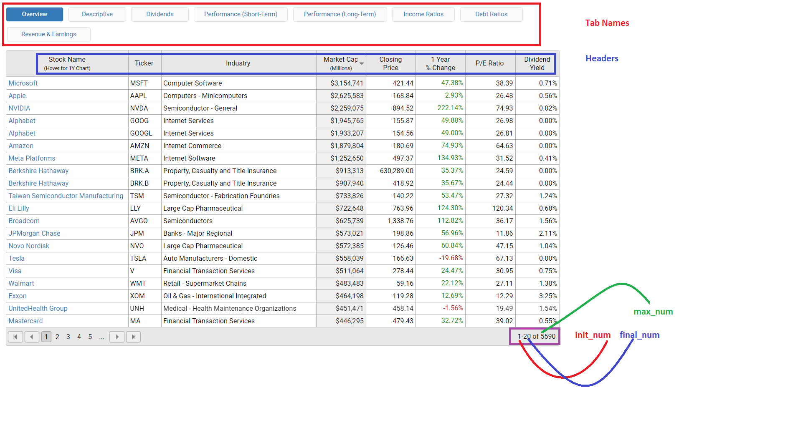
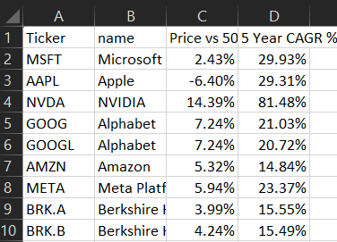
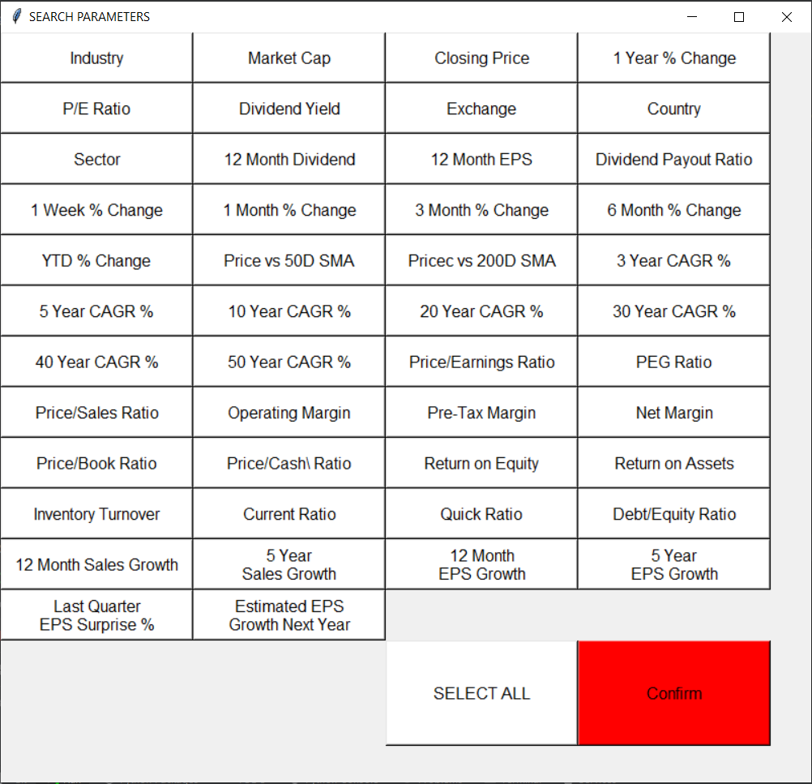

# MacroTrends data scrapper

Package for scrapping the desired data from the [MacroTrends stocks screner](https://www.macrotrends.net/stocks/stock-screener) and saving it into a `.csv` file.

Table being scrapped is shown below. The annotations are added to match the variable names used in the code.



An example of the scrapped data in a `.csv` file is given below.



First column and the second column of the `.csv` are always
set to `Ticker` and `name`, respectively.

      Note: This scrapper is designed to perform scrapping only
      on stock screener table on the MacroTrends website.

**Motivation**: This package is designed to learn and
implement web scrapping.

## Features

Scrapper will take care of saving the data to the same `.csv` file in the case
of:

 -**pre-termination**: This feature offers robustness when operation is
 terminated unexpectedly or manually.

   *Example:* Suppose scrapping operation is terminated halfway while `Market Cap`
   data of companies are being saved to `output.csv`. Selecting the `Market Cap`
   again (and possibly with other parameters) and targeting `output.csv` will
   result in the right behaviour that the code will recognize previously `Market
   Cap` was partially scrapped and handle the ordering of the data.

 -**partial scrapping**: Same output file can be used to scrap different
parameters in different runs. This feature is implemented because often
scrapping all the parameters in a single run can take a long time and it might
be desired to scrap parameters in multiple runs. This feature offers
re-usability.

   *Example:* You succesfully scrapped all the `Market Cap` data into
   `output.csv` and would like to also scrap `Dividend Yield`. Targeting
   `output.csv` to scrap `Dividend Yield` will append the `Dividend Yield` next
   to the already existing `Market Cap`. This allows to use the data scrapper
   multiple times with subset of parameters.

## Installation

### Prerequisites

- Python 3.x is installed to your system

### Installation steps

1. Clone this repository to your local machine

   ```bash
   git clone git@github.com:AlpSari/MagicInvest.git
   ```

2. Go to the directory

   ```bash
   cd MagicInvest
   ```

3. (Optional) Create a Python virtual environment and activate it:

   ```bash
   python -m venv .venv/
   ```

   From Windows command prompt (i.e., cmd), activate the virtual environment by:

   ```bash
   .venv/Scripts/activate
   ```

4. Install the required dependencies using pip:

   ```bash
   pip install -r requirements.txt
   ```

### Running the data scrapper

To run the data scrapper:

```bash
python main.py [arguments]
```

Running `main.py` without any arguments will open the GUI below for user to
select which parameters are to be scrapped and the scrapped data will be stored
in `Output.csv` in the current working directory. Run `python main.py -h` for
the list of the available arguments. The arguments are also explained below.



#### Arguments of main.py

- ` --parameters-path `: Path to the `JSON` file which stores the parameters to
be scrapped. User can avoid using the GUI by creating a `JSON` file (storing
parameters to be scrapped) and providing its path via this argument.

   Format of the `JSON` file:

   ```json
   ["param1", "param2", "...", "paramN"]
   ```

- ` --output-csv `: Name of the `CSV` file to which scrapped parameters are
  saved. Default is `Output.csv`.

- ` --logging-level `: Controls the logging level. The valid arguments are
  `["none", "info", "debug"]`. Default is set to `none`.

Example usage with the arguments:

```bash
python main.py --parameters-path example/example_parameters.json --output-csv my_file.csv --logging-level none
```

## Note To Developers

Developers should use the same code checking tools with the same settings that
are configured in the root directory. All the tools and plugins for development
can be downloaded using:

```bash
pip install -r dev_requirements.txt
```

## Testing

Unit tests for the package are available in the `tests/` directory. To run the tests, use the following command:

```bash
python -m unittest discover -v tests
```

Note that some of the GUI-related tests are causing display errors (in the remote server); therefore, those are not implemented yet.
